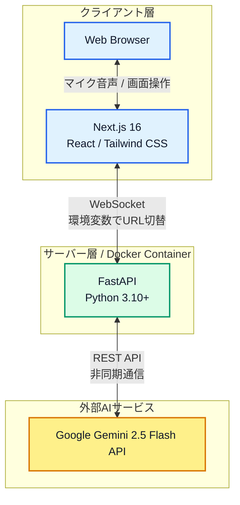
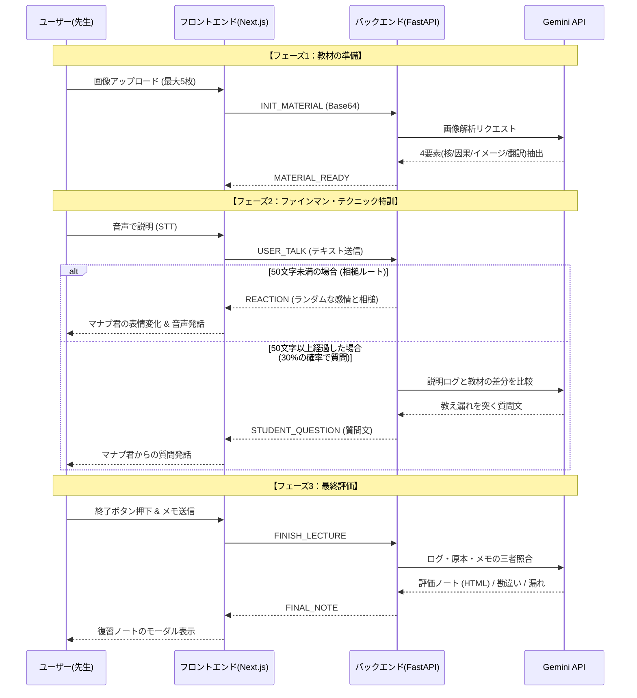
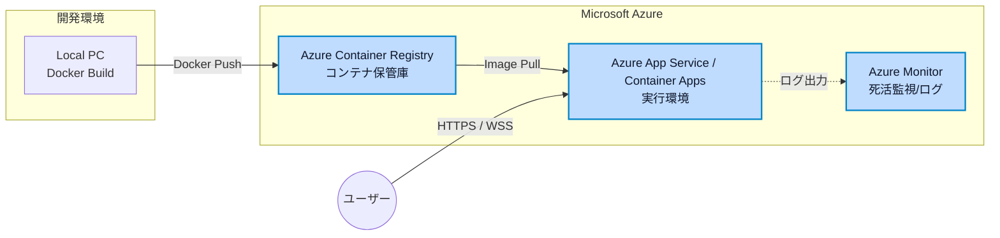

全体システム構成図（System Architecture）

```mermaid
graph TD
    subgraph Client [クライアント層]
        A[Web Browser]
        UI[Next.js 16<br>React / Tailwind CSS]
        A <-->|マイク音声 / 画面操作| UI
    end

    subgraph Server [サーバー層 / Docker Container]
        API[FastAPI<br>Python 3.10+]
        UI <-->|WebSocket<br>環境変数でURL切替| API
    end

    subgraph External [外部AIサービス]
        LLM[Google Gemini 2.5 Flash API]
        API <-->|REST API<br>非同期通信| LLM
    end

    classDef client fill:#e0f2fe,stroke:#2563eb,stroke-width:2px,color:#0f172a;
    classDef server fill:#dcfce7,stroke:#059669,stroke-width:2px,color:#0f172a;
    classDef external fill:#fef08a,stroke:#d97706,stroke-width:2px,color:#0f172a;

    class A,UI client;
    class API server;
    class LLM external;
```
リアルタイム通信シーケンス図（Real-time Sequence）

```mermaid
sequenceDiagram
    participant U as ユーザー(先生)
    participant F as フロントエンド(Next.js)
    participant B as バックエンド(FastAPI)
    participant G as Gemini API

    Note over U, G: 【フェーズ1：教材の準備】
    U->>F: 画像アップロード (最大5枚)
    F->>B: INIT_MATERIAL (Base64)
    B->>G: 画像解析リクエスト
    G-->>B: 4要素(核/因果/イメージ/翻訳)抽出
    B-->>F: MATERIAL_READY

    Note over U, G: 【フェーズ2：ファインマン・テクニック特訓】
    U->>F: 音声で説明 (STT)
    F->>B: USER_TALK (テキスト送信)
    
    alt 50文字未満の場合 (相槌ルート)
        B-->>F: REACTION (ランダムな感情と相槌)
        F-->>U: マナブ君の表情変化 & 音声発話
    else 50文字以上経過した場合 (30%の確率で質問)
        B->>G: 説明ログと教材の差分を比較
        G-->>B: 教え漏れを突く質問文
        B-->>F: STUDENT_QUESTION (質問文)
        F-->>U: マナブ君からの質問発話
    end

    Note over U, G: 【フェーズ3：最終評価】
    U->>F: 終了ボタン押下 & メモ送信
    F->>B: FINISH_LECTURE
    B->>G: ログ・原本・メモの三者照合
    G-->>B: 評価ノート (HTML) / 勘違い / 漏れ
    B-->>F: FINAL_NOTE
    F-->>U: 復習ノートのモーダル表示
```
Azure デプロイメント構成図（Azure Infrastructure）

```mermaid
graph LR
    subgraph Local [開発環境]
        Dev[Local PC<br>Docker Build]
    end

    subgraph Azure Cloud [Microsoft Azure]
        ACR[Azure Container Registry<br>コンテナ保管庫]
        ACA[Azure App Service / Container Apps<br>実行環境]
        Monitor[Azure Monitor<br>死活監視/ログ]
    end

    Dev -->|Docker Push| ACR
    ACR -->|Image Pull| ACA
    ACA -.->|ログ出力| Monitor

    User((ユーザー)) -->|HTTPS / WSS| ACA

    classDef azure fill:#bfdbfe,stroke:#0284c7,stroke-width:2px,color:#0f172a;
    class ACR,ACA,Monitor azure;
```
