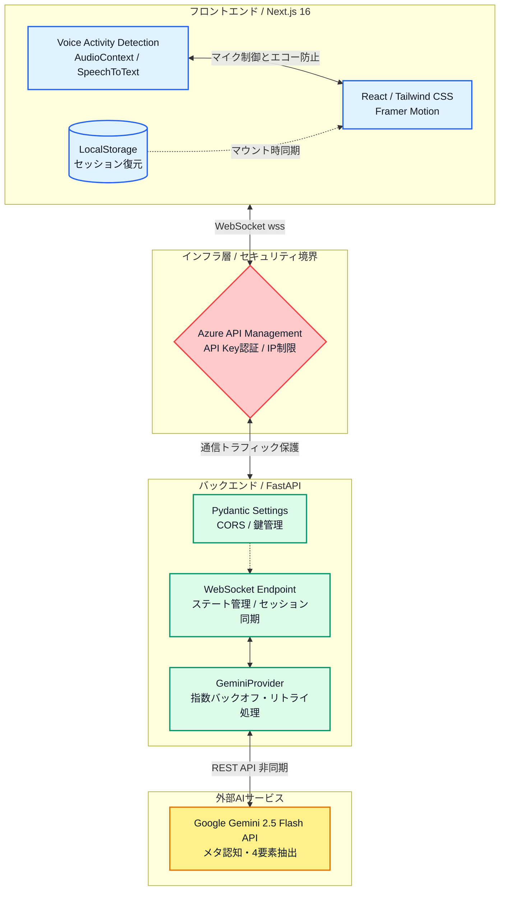
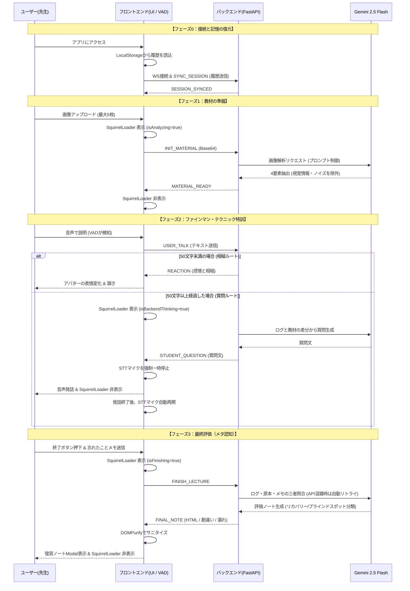
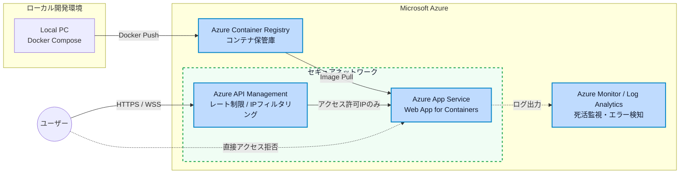

# 🎓 Drill-Talk (v3.0)

[](https://nextjs.org/)
[](https://react.dev/)
[](https://fastapi.tiangolo.com/)
[](https://www.docker.com/)

> **「教えることは、二度学ぶこと（To teach is to learn twice）」**
> ファインマン・テクニックに基づく、アウトプット特化型・メタ認知学習プラットフォーム。

Drill-Talkは、独学者が陥りがちな「分かったつもり」を解消するためのAI学習支援アプリケーションです。ユーザーがAI生徒「マナブ」に対して音声でレクチャーを行うことで、自身の知識の欠落（ブラインドスポット）を可視化し、学習の定着率を飛躍的に高めます。

## ✨ Core Features

*   **🗣️ 完全な音声UI (VUI) と排他制御**
    *   Web Audio APIとVAD (Voice Activity Detection) を独自実装。エコーバックを物理的に防ぎ、ストレスフリーな対話環境を実現。
*   **🧠 メタ認知評価システム (Tripartite Matching)**
    *   「ユーザーの発話ログ」「原本教材」「忘れたことメモ」の3点を Gemini 2.5 Flash API でクロスチェック。説明が漏れた箇所と勘違いを分離して提示します。
*   **⚡ ステートフルなリアルタイム通信**
    *   WebSocket を用いたステート管理により、ブラウザのリフレッシュや瞬断が起きても学習セッションを即座に復元可能です。
*   **🛡️ エンタープライズ級の堅牢性**
    *   インフラ起因のエラー（HTTP 429/503）に対する指数バックオフ（自動リトライ）処理や、Pydanticを用いた厳格な環境変数バリデーションを実装。

---

## 🛠 Tech Stack & Environment

| Category | Technology | Version / Details |
| :--- | :--- | :--- |
| **Frontend** | **Next.js 16.1.6**, **React 19.2.3** | TypeScript, Framer Motion, Tailwind CSS 4 |
| **Backend** | **FastAPI 0.136.0**, **Python 3.11.x** | Pydantic 2.13, uvicorn 0.44 |
| **AI / LLM** | **Google Gemini 2.5 Flash API** | google-genai 1.73 (JSON Mode / Multi-modal) |
| **DevOps** | **Docker**, **Docker Compose** | Multi-stage build (Standalone mode) |

---

## 🏗 System Architecture

全体システム構成図（System Architecture）

リアルタイム通信シーケンス図（Real-time Sequence）

Azure デプロイメント構成図（Azure Infrastructure）


## 📂 Directory Structure

```text
Drill-Talk-Portfolio/
├── frontend/                # Next.js 16 + TypeScript
│   ├── app/                 # App Router (Pages, Layouts)
│   ├── components/          # React components (VUI, Avatar, SquirrelLoader)
│   ├── hooks/               # Custom Hooks (useManabu, useVAD)
│   ├── package-lock.json    # 環境再現のための依存関係ロック
│   └── Dockerfile           # Next.js Standalone ビルド
├── backend/                 # FastAPI + Python 3.11
│   ├── main.py              # WebSocket handlers & routing
│   ├── logic.py             # Gemini API orchestration & Retry logic
│   ├── requirements.lock    # Python 依存関係ロック
│   └── Dockerfile           # Slim Python image
├── docker-compose.yml       # ローカル開発・本番共通環境
├── dev_log.md               # 開発・トラブルシューティング記録
└── README.md                # 本ドキュメント
```

## 🚀 Getting Started
本プロジェクトは Docker を用いてコンテナ化されており、環境変数を設定するだけで即座にローカル環境で実行可能です。

### 1. 環境変数 (.env) の設定
ルートディレクトリに `.env` ファイルを作成し、以下の内容を設定してください。

| 変数名 | 必須 | 説明 |
| :--- | :---: | :--- |
| `GEMINI_API_KEY` | ✅ | Google AI Studio で取得したAPIキー。 |
| `DRILLTALK_API_KEY` | ✅ | バックエンド側の認証用シークレットキー。 |
| `NEXT_PUBLIC_DRILLTALK_API_KEY` | ✅ | フロントエンド側の認証用。**`DRILLTALK_API_KEY` と同じ値**を設定してください。 |
| `ALLOWED_ORIGINS_RAW` | ❌ | CORS許可リスト。ローカル開発時は `http://localhost:3000` で固定。 |
| `NEXT_PUBLIC_WS_URL` | ❌ | WebSocket接続先。ローカル開発時は `localhost:8000` を指定。 |

### 2. アプリケーションの起動
Docker Compose を使用して、フロントエンド（3000番）とバックエンド（8000番）を一括でビルド・起動します。
`docker-compose up -d --build`

### 3. アクセス
ビルド完了後、ブラウザで以下のURLにアクセスしてください。
* Frontend (UI): http://localhost:3000
* Backend (API Docs): http://localhost:8000/docs

## 📓 Developer Log
詳細な技術選定の理由やトラブルシューティングの軌跡は、開発ログ (dev_log.md) を参照してください。