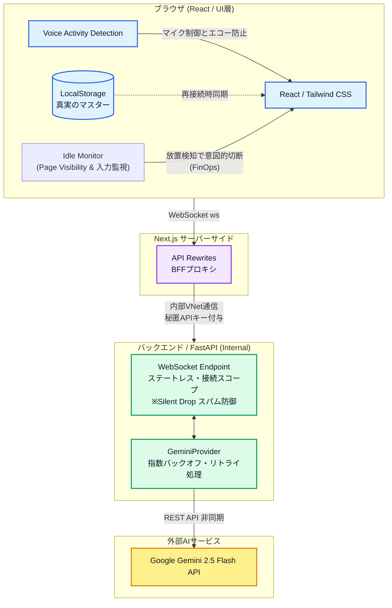
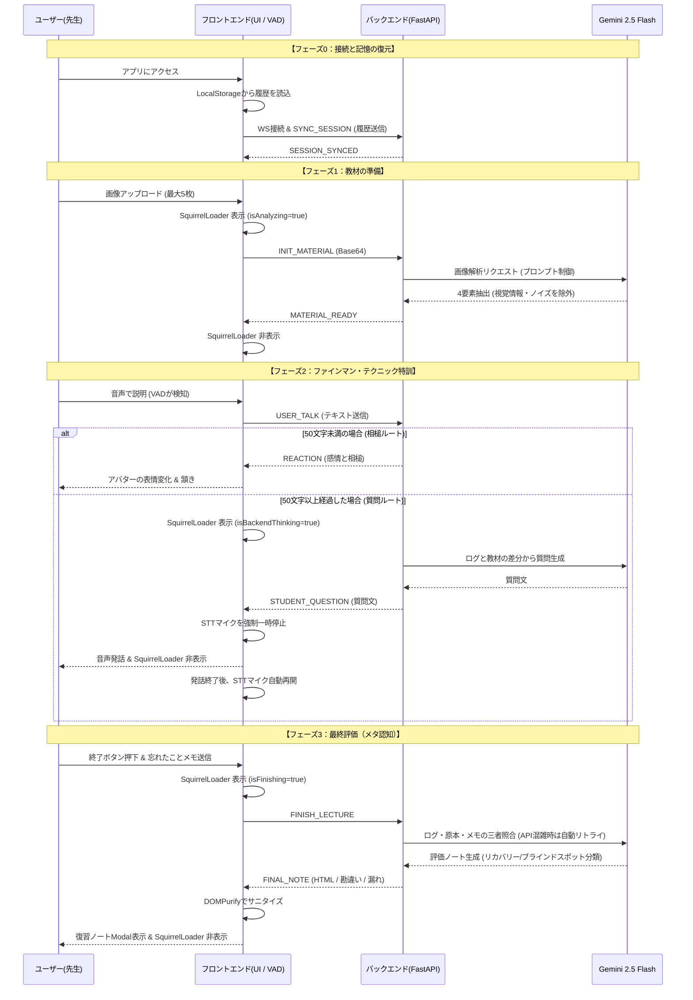

# 🎓 Drill-Talk (v3.2)

[](https://nextjs.org/)
[](https://react.dev/)
[](https://fastapi.tiangolo.com/)
[](https://www.docker.com/)

**🚀 Live Demo:** [https://aca-drilltalk-prod-frontend.jollyflower-3069cfc3.japanwest.azurecontainerapps.io](https://aca-drilltalk-prod-frontend.jollyflower-3069cfc3.japanwest.azurecontainerapps.io)
*(💡 インフラコスト最適化のため、日本時間の 8:00〜24:00 のみ稼働しています)*


||||


> **「教えることは、二度学ぶこと（To teach is to learn twice）」**
> ファインマン・テクニックに基づく、アウトプット特化型・メタ認知学習プラットフォーム。

Drill-Talkは、独学者が陥りがちな「分かったつもり」を解消するためのAI学習支援アプリケーションです。ユーザーがAI生徒「マナブ」に対して音声でレクチャーを行うことで、自身の知識の欠落（ブラインドスポット）を可視化し、学習の定着率を飛躍的に高めます。

## ✨ Core Features

*   **🗣️ 完全な音声UI (VUI) とマイクの排他制御**
    *   ブラウザの音声認識APIと、AIの発話状態（TTS）を同期させる独自のステート管理を実装。マナブ君の発話中はマイク入力をソフトウェアレベルで強制遮断することでエコーバックを完封し、ストレスフリーな対話環境を実現。
*   **🧠 メタ認知評価システム (Tripartite Matching)**
    *   「ユーザーの発話ログ」「原本教材」「忘れたことメモ」の3点を Gemini 2.5 Flash API でクロスチェック。説明が漏れた箇所と勘違いを分離して提示します。
*   **⚡ クラウドネイティブな耐障害性 (Connection-scoped state)**
    *   コンテナインフラ（Azure Container Apps等）のエフェメラルな性質に対応するため、バックエンドは完全なステートレス設計を採用。WebSocketの切断・コンテナの再起動が発生しても、フロントエンドのLocalStorageから瞬時にセッションを再構築（SYNC_SESSION）し、学習データをロストしません。
*   **🛡️ BFFプロキシによるゼロ・シークレット・フロントエンド**
    *   Next.jsのサーバーサイド機能（Rewrites/API Routes）をBFF（Backend For Frontend）として活用。ブラウザ側にAPIキーを一切露出させず、サーバー間通信でのみ認証を行う強固なセキュリティ境界を構築しています。
*   **🔐 マネージドIDとRBACによるパスワードレス・アーキテクチャ**
    *   Azure User-Assigned Managed Identities と RBAC を採用。。コンテナからKey Vaultへのアクセスにおいて、パスワードやアクセスキーの管理を排除しました。APIキーはBicepのパラメータとして渡すのではなく、Key Vault内のシークレットを直接参照（Secret Reference）して環境変数に注入しています。
*   **🕰️ FinOps (コスト最適化) と徹底したインフラ保護**
    *   **バックエンドの自動スケール:** KEDA (Cronスケーラー) を導入し、「営業時間（8:00-24:00）のみ1台稼働、深夜帯はゼロスケール」という基本のコスト最適化を実施。
    *   **フロントエンド主導の課金ストップ:** ユーザーのタブ放置による「WebSocketのアクティブ課金垂れ流し」を防ぐため、Page Visibility API とユーザー入力監視を統合したタイムアウト機構を実装。5分間の放置で自発的に通信を切断してコンテナを「アイドル状態（約1/10のコスト）」へ移行させ、ユーザーが戻った瞬間にシームレスに記憶を復旧させます。
    *   **Silent Drop:** DDoSやスパムによるAPI課金増大を防ぐため、異常な連続送信を検知した際、エラーすら返さずに無音で破棄する防波堤をアプリケーション層に設けています。
*   **🤖 GitHub Actions による完全自動化 CI/CD パイプライン**
    *   `master` ブランチへの Push をトリガーとして、GitHub 上のホステッドランナーでコンテナイメージのビルドを実行。Azure 側のコンピューティング課金を発生させず（ACR Tasks 不使用）、安全な OIDC 認証（または Service Principal）経由で Azure Container Registry へのプッシュと Container Apps のリビジョン更新を完全自動化しています。
*   **ログとストレージの極小化:**
    *   正常系のアクセスログをアプリケーション層で完全に消音（`--no-access-log` / `WARNING`レベル固定）し、Log Analyticsに1日50MBの物理キャップ（Quota）をBicepで設定。さらにGitHub ActionsでACRの古いコンテナイメージを自動パージ（最新2世代のみ保持）することで、ログ爆発とストレージ超過による「クラウド破産」をアーキテクチャレベルで完全に防いでいます。
---

## 🛠 Tech Stack & Environment

| Category | Technology | Version / Details |
| :--- | :--- | :--- |
| **Frontend** | **Next.js 16.1.6**, **React 19.2.3** | TypeScript, Framer Motion, Tailwind CSS 4 |
| **Backend** | **FastAPI 0.136.0**, **Python 3.11.x** | Pydantic 2.13, uvicorn 0.44 |
| **AI / LLM** | **Google Gemini 2.5 Flash API** | google-genai 1.73 (JSON Mode / Multi-modal) |
| **DevOps** | **Docker**, **Docker Compose** | Multi-stage build (Standalone mode) |

---

## 🏗 System Architecture

全体システム構成図（System Architecture）

リアルタイム通信シーケンス図（Real-time Sequence）

Azure デプロイメント構成図（Azure Infrastructure）

```mermaid
graph LR
    subgraph Local ["ローカル開発環境"]
        Dev["Local PC<br>Docker Compose"]
    end

    subgraph CI_CD ["CI/CD パイプライン"]
        GitHub["GitHub Actions<br>ホステッドランナー"]
    end

    subgraph AzureCloud ["Microsoft Azure"]
        
        subgraph FrontendZone ["フロントエンド層 / BFF"]
            ACA_Front["Azure Container Apps<br>Next.js Frontend<br>Scale: 0-2 / External"]
        end

        subgraph BackendZone ["バックエンド層 / 内部通信"]
            ACA_Back["Azure Container Apps<br>FastAPI Backend<br>Scale: 0-1 / Internal<br>※KEDA Cron Scaling"]
        end

        subgraph StorageZone ["機密・コンテナ保管"]
            ACR["Azure Container Registry<br>Dockerイメージ保管庫"]
            AKV["Azure Key Vault<br>APIキー等シークレット管理"]
        end
        
        subgraph FinOpsZone ["監視・予算統制層"]
            AppInsights["Application Insights<br>パフォ監視 / AI通信計測"]
            LogAnalytics["Log Analytics<br>統合ログデータレイク"]
            Budget["Cost Management<br>予算アラート制御"]
        end
    end

    %% デプロイメントフロー
    Dev -->|"git push (master)"| GitHub
    GitHub -->|"Docker Build & Push"| ACR
    ACR -.->|"Image Pull"| ACA_Front
    ACR -.->|"Image Pull"| ACA_Back
    AKV -.->|"Managed Identity経由でSecretRef注入"| ACA_Back
    AKV -.->|"シークレット参照"| ACA_Front

    %% トラフィックフロー
    User(("ユーザー")) -->|"HTTPS / WSS"| ACA_Front
    ACA_Front -->|"内部VNet通信<br>(Secret Key付与)"| ACA_Back

    %% テレメトリと監視フロー
    ACA_Front -->|"テレメトリ送信"| AppInsights
    ACA_Back -->|"テレメトリ送信"| AppInsights
    AppInsights -->|"データ格納"| LogAnalytics
    ACA_Front -->|"コンテナログ出力"| LogAnalytics
    ACA_Back -->|"コンテナログ出力"| LogAnalytics
    LogAnalytics -.->|"利用料監視"| Budget
    Budget -.->|"閾値超過で通知"| Admin(("管理者 / メール"))

    classDef azure fill:#bfdbfe,stroke:#0284c7,stroke-width:2px,color:#0f172a;
    classDef finops fill:#fef08a,stroke:#d97706,stroke-width:2px,color:#0f172a;
    classDef storage fill:#f3e8ff,stroke:#9333ea,stroke-width:2px,color:#0f172a;
    classDef internal fill:#f1f5f9,stroke:#64748b,stroke-width:2px,color:#0f172a,stroke-dasharray: 5 5;
    classDef github fill:#e2e8f0,stroke:#1e293b,stroke-width:2px,color:#0f172a;
    
    class ACR,ACA_Front azure;
    class AKV storage;
    class AppInsights,LogAnalytics,Budget finops;
    class ACA_Back internal;
    class GitHub github;

    %% サブグラフへのスタイル指定
    style CI_CD fill:#f8fafc,stroke:#1e293b,stroke-width:2px,color:#0f172a;
    style BackendZone fill:#f8fafc,stroke:#94a3b8,stroke-width:2px,color:#0f172a,stroke-dasharray: 5 5;
    style FinOpsZone fill:#fef08a,stroke:#d97706,stroke-width:2px,color:#0f172a;
```


## 📂 Directory Structure

```text
Drill-Talk-Portfolio/
├── .github/                 # GitHub Actions 設定
│   └── workflows/
│       └── deploy.yml       # Azureへの自動デプロイ定義 (CI/CD)
├── frontend/                # Next.js 16 + TypeScript
│   ├── app/                 # App Router (Pages, Layouts)
│   ├── components/          # React components (ManabuAvatar, NotebookModal, etc.)
│   ├── hooks/               # Custom Hooks (useManabu, useIdleTimeout, useSpeechToText, etc.)
│   ├── middleware.ts        # CSWSH対策（セキュリティ検証）＆ 認証ヘッダー付与
│   ├── next.config.ts       # Standaloneコンテナビルド最適化設定
│   ├── package-lock.json    # 環境再現のための依存関係ロック
│   └── Dockerfile           # Next.js Standalone ビルド
├── backend/                 # FastAPI + Python 3.11
│   ├── main.py              # WebSocket handlers & routing
│   ├── logic.py             # Gemini API orchestration & Retry logic
│   ├── config.py            # Pydanticによる環境変数・CORSの堅牢なバリデーション
│   ├── requirements.lock    # Python 依存関係ロック
│   └── Dockerfile           # Slim Python image (非root実行・セキュリティ強化)
├── docker-compose.yml       # ローカル開発用の環境一括起動定義（本番と同一のコンテナ構成を再現）
├── dev_log.md               # 開発・トラブルシューティング記録
├── main.bicep               # 自動デプロイのための Bicep テンプレート
└── README.md                # 本ドキュメント
```

## 🚀 Getting Started
本プロジェクトは Docker を用いてコンテナ化されており、環境変数を設定するだけで即座にローカル環境で実行可能です。

### 1. 環境変数 (.env) の設定
ルートディレクトリに `.env` ファイルを作成し、以下の内容を設定してください。

| 変数名 | 必須 | 説明 |
| :--- | :---: | :--- |
| `GEMINI_API_KEY` | ✅ | Google AI Studio で取得したAPIキー。本番環境ではAzure Key Vaultから安全に注入されます。 |
| `DRILLTALK_API_KEY` | ✅ |バックエンド認証用。本番(Azure)では Key Vault シークレットから自動注入されます。|
| `ALLOWED_ORIGINS_RAW` | ❌ | CORS許可リスト。ローカル開発時は `http://localhost:3000` で固定。 |

### 2. アプリケーションの起動
Docker Compose を使用して、フロントエンド（3000番）とバックエンド（8000番）を一括でビルド・起動します。
`docker-compose up -d --build`

### 3. アクセス
ビルド完了後、ブラウザで以下のURLにアクセスしてください。
* Frontend (UI): http://localhost:3000
* Backend (API Docs): http://localhost:8000/docs

### ☁️ Cloud Deployment (Azure)
本プロジェクトの本番環境（Production）は、BicepによるInfrastructure as Code (IaC) と GitHub Actions を用いてデプロイされています。
1. **インフラのプロビジョニング:** `main.bicep` を用いて、Azure CLI経由でリソース（Container Apps, ACR, Key Vault, Log Analytics）を自動構築。(リソースグループ名は rg-drilltalk-v3.2 （または自身の指定した名前）にする必要がある)
2. **シークレットの注入:** 本番用の `GEMINI_API_KEY` 等は、手動で Azure Key Vault に格納し、ゼロ・シークレットを担保。
3. **継続的デプロイメント:** `.github/workflows/deploy.yml` により、コード更新時に自動ビルド・デプロイが実行されます。

**【必須セットアップ】**
- **GitHub Secrets:** `AZURE_CREDENTIALS` (Azure認証用JSON)、`UNIQUE_SUFFIX` (ACR識別子) を登録。
- **環境変数:** BFF/CORS保護のため、Container Appsの `ALLOWED_ORIGINS_RAW` にフロントエンドURLを設定。

### 💰 Running Cost Estimate (v3.2)
- **リージョン:** Japan west (西日本)
- **ユーザー規模:** 月間 30名程度を想定
ポートフォリオ運用のためのコストは月額合計 約7,530円

| サービス / 内訳 | 月額概算費用 | 計算の根拠・ロジック |
| :--- | :--- | :--- |
| **ACA (Backend)** | **¥1,400** | 月300時間アクティブ・月180時間アイドル状態で計算 |
| **ACA (Frontend)** | **¥1,400** | 月300時間アクティブ・月180時間アイドル状態で計算 |
| **Container Registry** | **¥750** | Basic ティアの固定費 |
| **Bandwidth / Key Vault** | **¥20** | 微量の通信と操作 |
| **Log Analytics** | **¥0** | 1日50MBの物理キャップ ＋ 正常ログ消音設計により無料枠（5GB/月） |
| **App Insights** | **¥0** | Log Analytics 枠に依存 |
| **Gemini 2.5 Flash** | **¥3,960~** | 1セッション1.1円として1人1日4セッションで計算 |

## 🗺️ Future Roadmap (v4.0 and beyond)

本プロジェクトは現在、ブラウザの `localStorage` とコンテナの接続スコープを利用したスタンドアロン環境として稼働していますが、次期バージョン（v4.0以降）では、データ駆動型のパーソナル学習プラットフォームへの進化を計画しています。

### 1. ユーザー認証の導入とゼロトラストセキュリティ
現在のBFF（Backend For Frontend）プロキシにおけるAPIキー管理の技術的負債を解消し、エンタープライズ水準のセキュリティを確保します。
*   **Auth.js (NextAuth) / Azure Entra ID の導入:** OAuth2.0ベースのログイン機能（Google/GitHub/Microsoftアカウント連携）を実装します。

### 2. 学習データの永続化（Cloud Database）
揮発性の高いステート管理から脱却し、マルチテナント対応のデータストアを導入します。
*   **Azure Database for PostgreSQL の統合:** ユーザープロファイル、アップロードされた教材データ（BLOBストレージとの連携）、過去の発話ログ、および生成された評価ノートをリレーショナルデータベースで一元管理します。
*   **デバイス間のシームレスな学習:** PCでアップロードした教材を使って、移動中にスマートフォンで音声レクチャーを行うなど、クロスデバイスでの学習再開を可能にします。

### 3. エビングハウスの忘却曲線に基づく復習システム (Spaced Repetition)
「分かったつもり」を解消した後の、「記憶の定着」までをシステムがカバーします。
*   **インテリジェント・リマインダー:** 評価ノートで抽出された「勘違い (Misconceptions)」やユーザー自身が書き残した「忘れたことメモ」をデータベースに蓄積。エビングハウスの忘却曲線をアルゴリズムに応用し、記憶が薄れる最適なタイミング（1日後、3日後、1週間後など）で復習を促す通知（Email/Push）を自動送信します。

### 4. メタ認知ダッシュボード（Learning Analytics）
ユーザー自身の成長を可視化し、モチベーションを維持する機能を提供します。
*   **学習傾向の分析:** 過去の評価ノートを横断的に解析し、「論理展開の飛躍が多い」「特定のキーワードを忘れがちである」といったユーザー固有のブラインドスポットの傾向をグラフ化してフィードバックします。

## 📓 Developer Log
詳細な技術選定の理由やトラブルシューティングの軌跡は、[開発ログ (dev_log.md)](./dev_log.md) を参照してください。
