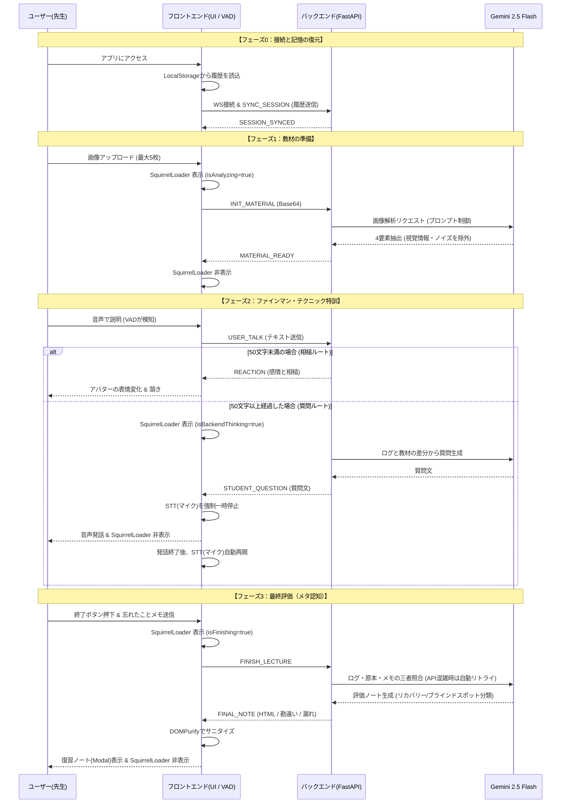

全体システム構成図（System Architecture）
```mermaid
graph TD
    subgraph Client [フロントエンド / Next.js 16]
        UI[React / Tailwind CSS<br>Framer Motion (Squirrel/Avatar)]
        VAD[Voice Activity Detection<br>AudioContext / SpeechToText]
        Storage[(LocalStorage<br>セッション復元)]
        
        VAD <-->|マイク制御/エコー防止| UI
        Storage -.->|マウント時同期| UI
    end

    subgraph Gatekeeper [インフラ層 / セキュリティ境界]
        APIM{Azure API Management<br>API Key認証 / IP制限}
    end

    subgraph Server [バックエンド / FastAPI]
        Config[Pydantic Settings<br>CORS / 鍵管理]
        WS[WebSocket Endpoint<br>ステート管理 / セッション同期]
        Logic[GeminiProvider<br>指数バックオフ・リトライ処理]
        
        Config -.-> WS
        WS <--> Logic
    end

    subgraph External [外部AIサービス]
        LLM[Google Gemini 2.5 Flash API<br>メタ認知・4要素抽出]
    end

    Client <-->|WebSocket (wss://)| APIM
    APIM <-->|通信トラフィック保護| Server
    Logic <-->|REST API (非同期)| LLM

    classDef client fill:#e0f2fe,stroke:#2563eb,stroke-width:2px,color:#0f172a;
    classDef gatekeeper fill:#fecaca,stroke:#ef4444,stroke-width:2px,color:#0f172a;
    classDef server fill:#dcfce7,stroke:#059669,stroke-width:2px,color:#0f172a;
    classDef external fill:#fef08a,stroke:#d97706,stroke-width:2px,color:#0f172a;

    class UI,VAD,Storage client;
    class APIM gatekeeper;
    class WS,Logic,Config server;
    class LLM external;
```
リアルタイム通信シーケンス図（Real-time Sequence）

Azure デプロイメント構成図（Azure Infrastructure）
```mermaid
graph LR
    subgraph Local [ローカル開発環境]
        Dev[Local PC<br>Docker Compose]
    end

    subgraph Azure Cloud [Microsoft Azure]
        ACR[Azure Container Registry<br>コンテナ保管庫]
        
        subgraph Security Zone [セキュアネットワーク]
            APIM[Azure API Management<br>レート制限 / IPフィルタリング]
            ACA[Azure App Service<br>Web App for Containers]
            APIM -->|アクセス許可IPのみ| ACA
        end
        
        Monitor[Azure Monitor / Log Analytics<br>死活監視・エラー検知]
    end

    Dev -->|Docker Push| ACR
    ACR -->|Image Pull| ACA
    ACA -.->|ログ出力| Monitor

    User((ユーザー)) -->|HTTPS / WSS| APIM
    User -.->|直接アクセス (拒否)| ACA

    classDef azure fill:#bfdbfe,stroke:#0284c7,stroke-width:2px,color:#0f172a;
    classDef secure fill:#f0fdf4,stroke:#16a34a,stroke-width:2px,color:#0f172a,stroke-dasharray: 5 5;
    
    class ACR,APIM,ACA,Monitor azure;
    class Security Zone secure;
```
